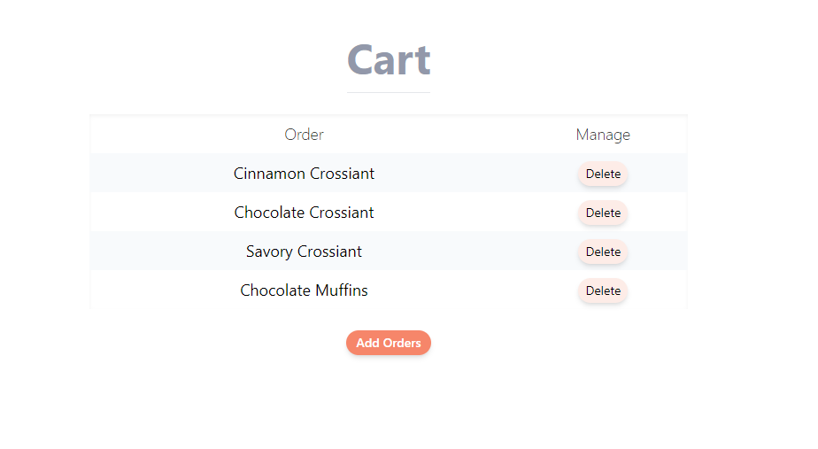
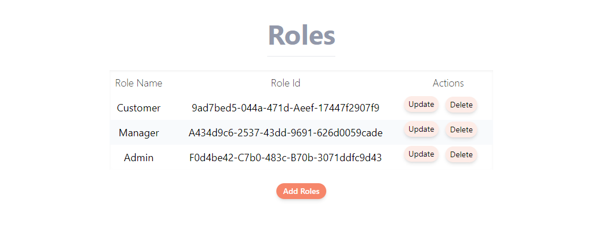
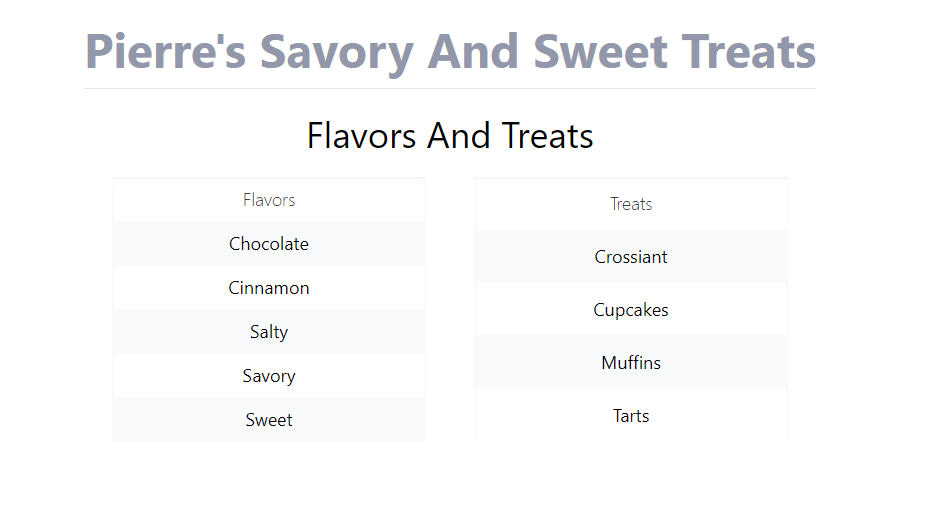
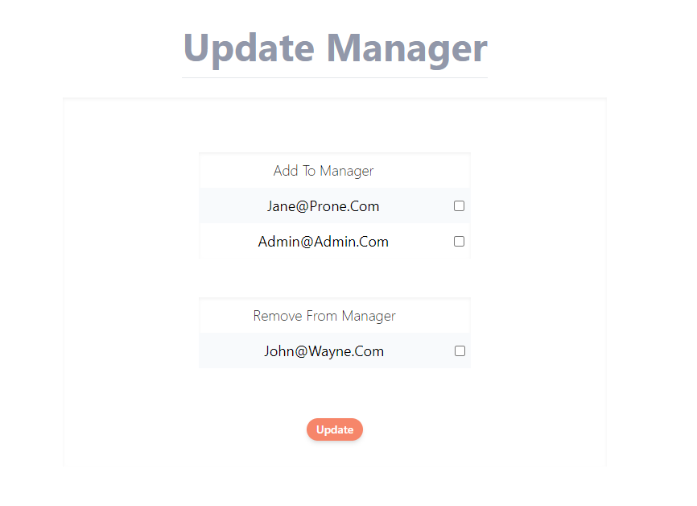

# Treats
#### An appilcation that allows users to manage flavors and treats.
#### By [Brian Noh](https://github.com/noh24/) 

## Technologies Used
* C#
* .NET 6
* ASP.Net Core 6 MVC
* EF Core 6
* ASP.Net Core Identity
* MySQL
* MySQL Workbench
* LINQ
* Razor
* Tailwind CSS
* Html

## Description
This application allows the users view and manage flavored treats, sign up and login to their accounts.  
Implemented role based authorizations to allow functions based on user's assigned role.  
* Users have an option to login as admin  
* Click on Register [Top Right Navbar]  
* Login email address: admin@admin.com
* Login password: a  




## Setup/Installation Requirements
- Clone this repository to your Desktop:
  1. Your computer will need to have GIT installed. If you do not currently have GIT installed, follow [these](https://docs.github.com/en/get-started/quickstart/set-up-git) directions for installing and setting up GIT.
  2. Once GIT is installed, clone this repository by typing following commands in your command line:
     ```
     ~ $ cd Desktop
     ~/Desktop $ git clone https://github.com/noh24/Treats.Solution.git
     ~/Desktop $ cd Treats.Solution
     ```
- Install the [.NET 6 SDK](https://dotnet.microsoft.com/en-us/download/dotnet/6.0)
- Install Packages for EF Core and a tool to update databases:
  ```
  ~/Desktop/Treats.Solution $ dotnet add package Microsoft.EntityFrameworkCore -v 6.0.0
  ~/Desktop/Treats.Solution $ dotnet add package Pomelo.EntityFrameworkCore.MySql -v 6.0.0-alpha.2
  ~/Desktop/Treats.Solution $ dotnet tool install --global dotnet-ef --version 6.0.0
  ```
- Create .gitignore file:
  ```
   ~/Desktop/Treats.Solution/ $ touch .gitignore
   ~/Desktop/Treats.Solution/ $ echo "*/obj/
   */bin/
   */appsettings.json" > .gitignore
  ```
- Create appsettings.json file:
  ```
   ~/Desktop/Treats.Solution $ cd Treats
   ~/Desktop/Treats.Solution/Treats $ touch appsettings.json
   ~/Desktop/Treats.Solution/Treats $ echo '{
      "ConnectionStrings": {
        "DefaultConnection": "Server=localhost;Port=3306;database=brian_noh;uid=root;pwd=[PASSWORD];"
      }
    }' > appsettings.json
  ```
  [PASSWORD] is your password
- Install dependencies:
  ```
   ~/Desktop/Treats.Solution/ $ npm install
  ```
- Update Database:
  ```
  ~/Desktop/Treats.Solution/ $ dotnet ef database update --project Treats
  ```
- Build the project:
  ```
   ~/Desktop/Treats.Solution/ $ dotnet build Treats/
  ```
- Run the project
  ```
   ~/Desktop/Treats.Solution/ $ dotnet run --project Treats/
  ```
- Visit [http://localhost:5000](http://localhost:5000) to try this application

## Known Bugs

* No known bugs. If you find one, please email me at brian.noh95@gmail.com with the subject **[_Repo Name_] Bug** and include:
  * BUG: _A brief description of the bug_
  * FIX: _Suggestion for solution (if you have one!)_
  * If you'd like to be credited, please also include your **_github user profile link_**

## License

MIT License

Copyright &copy; 2023 Brian Noh

Permission is hereby granted, free of charge, to any person obtaining a copy of this software and associated documentation files (the "Software"), to deal in the Software without restriction, including without limitation the rights to use, copy, modify, merge, publish, distribute, sublicense, and/or sell copies of the Software, and to permit persons to whom the Software is furnished to do so, subject to the following conditions:

The above copyright notice and this permission notice shall be included in all copies or substantial portions of the Software.

THE SOFTWARE IS PROVIDED "AS IS", WITHOUT WARRANTY OF ANY KIND, EXPRESS OR IMPLIED, INCLUDING BUT NOT LIMITED TO THE WARRANTIES OF MERCHANTABILITY, FITNESS FOR A PARTICULAR PURPOSE AND NONINFRINGEMENT. IN NO EVENT SHALL THE AUTHORS OR COPYRIGHT HOLDERS BE LIABLE FOR ANY CLAIM, DAMAGES OR OTHER LIABILITY, WHETHER IN AN ACTION OF CONTRACT, TORT OR OTHERWISE, ARISING FROM, OUT OF OR IN CONNECTION WITH THE SOFTWARE OR THE USE OR OTHER DEALINGS IN THE SOFTWARE.
